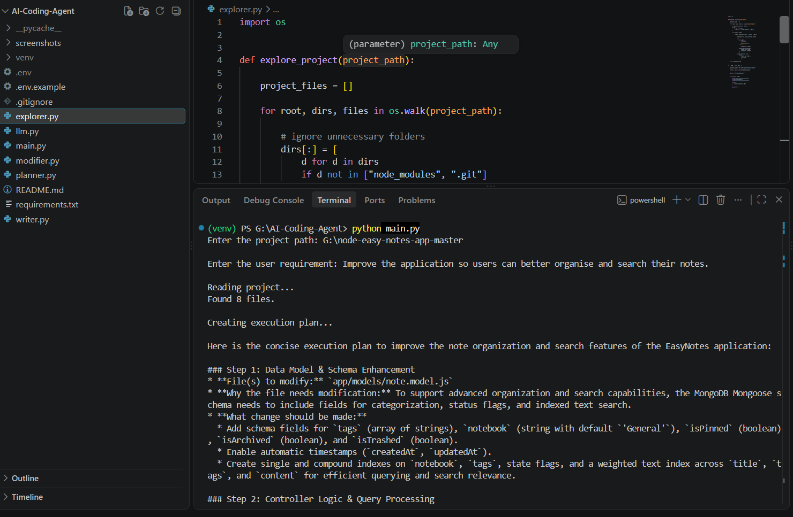
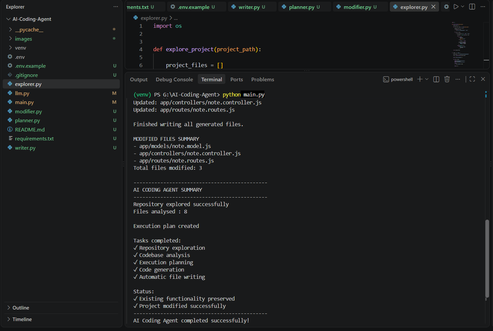

# AI Coding Agent

## Overview

This project implements an AI coding agent that analyzes an existing codebase and applies feature changes based on user requirements.

The agent does not generate code from scratch. Instead, it first explores the repository, creates an implementation plan, generates the required code changes using Google's Gemini API, and automatically updates the relevant files.

Working on this project gave me a better understanding of how AI coding assistants analyze repositories and assist developers with code generation. 

---

## Features

- Accepts a repository path and feature request from the user.
- Explores an existing project and reads its source files.
- Builds a project context for the LLM.
- Generates an implementation plan based on the user's requirement.
- Produces updated source code using Google's Gemini API.
- Automatically updates the required project files.
- Displays a summary of modified files after execution.

---

## How It Works

The project is divided into small modules, where each module is responsible for a specific task.

### Step 1 – Explore the Repository

The agent receives the repository path from the user, scans the project directory, and reads relevant source files to build project context.

### Step 2 – Create an Implementation Plan

The project context and the user's requirement are sent to the Gemini model. Based on this information, the model generates a step-by-step implementation plan.

### Step 3 – Generate Updated Code

Using the implementation plan, the agent requests the updated source code from the LLM. Only the files that need modifications are generated.

### Step 4 – Update the Project

The generated response is parsed using regular expressions, and the updated code is written back to the corresponding files. After the process is complete, the agent displays a summary of all modified files.

### Workflow

```text
               User Requirement
                       │
                       ▼
            Repository Exploration
                       │
                       ▼
            Build Project Context
                       │
                       ▼
        Implementation Planning
               (Gemini API)
                       │
                       ▼
            Code Generation
               (Gemini API)
                       │
                       ▼
         Automatic File Update
                       │
                       ▼
        Modified Files Summary
```

---

## Screenshots

### Implementation Planning

The agent analyzes the project context and creates an execution plan based on the user's requirement.




### Final Execution Output

The agent generates the required changes, updates the project files automatically, and displays the execution summary.



---
## Project Structure

```text
AI-Coding-Agent/
│
├── screenshots/
│   ├── execution_plan.png
│   └── final_output.png
│
├── main.py          # Starts the workflow
├── explorer.py      # Reads project files
├── planner.py       # Generates the implementation plan
├── modifier.py      # Generates updated source code
├── writer.py        # Updates project files
├── llm.py           # Handles Gemini API communication
├── README.md
├── requirements.txt
├── .gitignore
├── .env.example
```

---

## Installation

Clone the repository.

```bash
git clone <repository-url>
cd AI-Coding-Agent
```

Create a virtual environment.

```bash
python -m venv venv
```

Activate the virtual environment.

```bash
venv\Scripts\activate
```

Install the required packages.

```bash
pip install -r requirements.txt
```

Create a `.env` file and add your Gemini API key.

```env
GEMINI_API_KEY=your_api_key_here
```

---

## Usage

Run the agent:

```bash
python main.py
```

Provide the repository path and feature request when prompted.

Example:

```text
Enter the project path:
G:\node-easy-notes-app

Enter the user requirement:
Improve the application so users can better organise and search their notes.
```

The agent will:

- Explore the repository.
- Create an implementation plan.
- Generate updated code.
- Modify the required files.
- Display a summary of the modified files.

## Technologies Used

- Python
- Google Gemini API
- Google GenAI SDK
- python-dotenv
- Regular Expressions (Regex)

---

## Assumptions and Trade-offs

### Assumptions

- The user provides a valid repository path and a clear feature request.
- The existing repository structure and code are understandable from the files provided to the agent.
- The LLM can identify the relevant files and suggest appropriate changes based on the user requirement.
- The generated changes are expected to follow the existing project structure and coding style.

### Trade-offs

- The agent is designed for small to medium-sized repositories and may require improvements for very large codebases.
- The generated code is not automatically tested before applying changes.
- The current implementation uses a simple file-based approach, which keeps the agent lightweight but can be extended with more advanced repository analysis in the future.

---

## Limitations

- Currently supports command-line execution.
- Depends on the Gemini API for planning and code generation.
- Tested on a small Node.js project.
- Accepts one feature request at a time through command-line input.

---

## Future Improvements

Some improvements that can be added in the future are:

- Support additional programming languages.
- Improve prompt design for better code generation.
- Handle larger repositories more efficiently.
- Add a simple web interface.